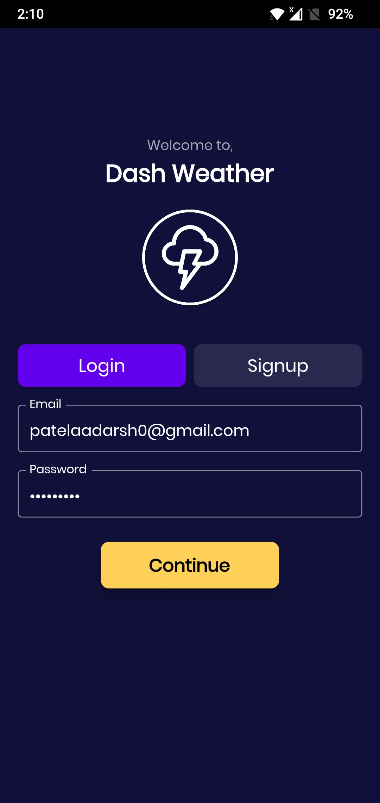
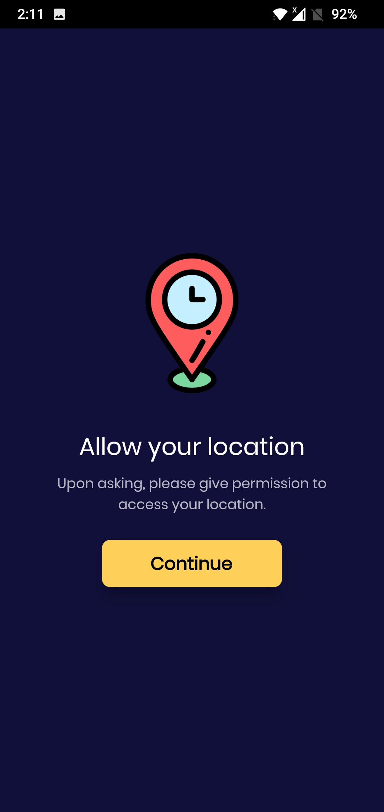
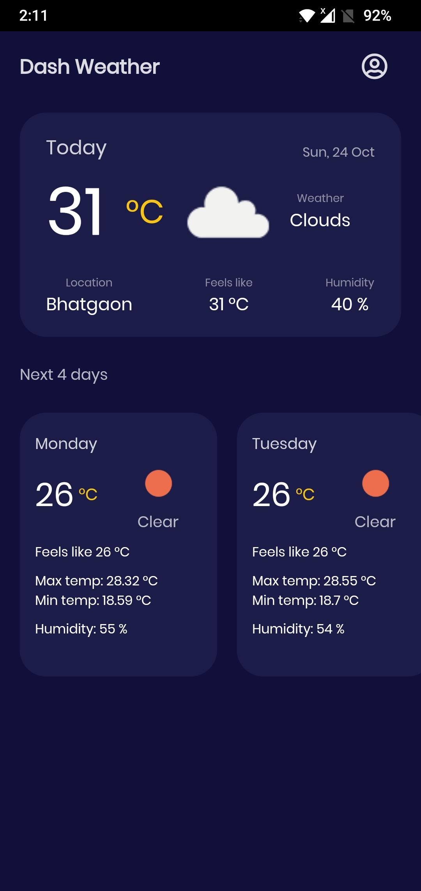

## Dash Weather app

### Key-features

* Firebase authentication service for signup/login using email.
* Bloc architecture for state management.
* Geolocator plugin for getting device's location.
* OpenWeatherMap API for fetching data.

### Screenshots

<table>
  <tr>
    <td></td>
    <td></td>
    <td></td>
    <td></td>
  </tr>
 </table>

